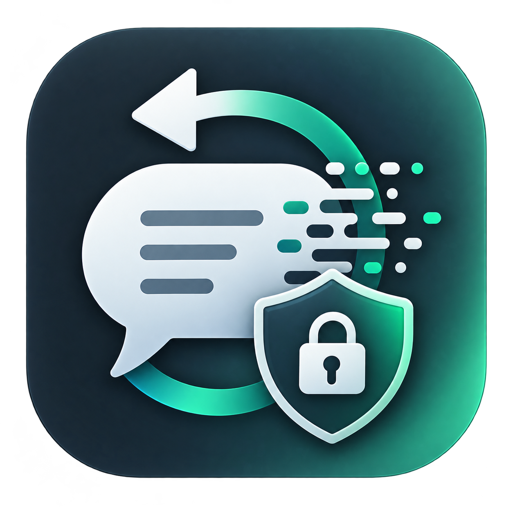
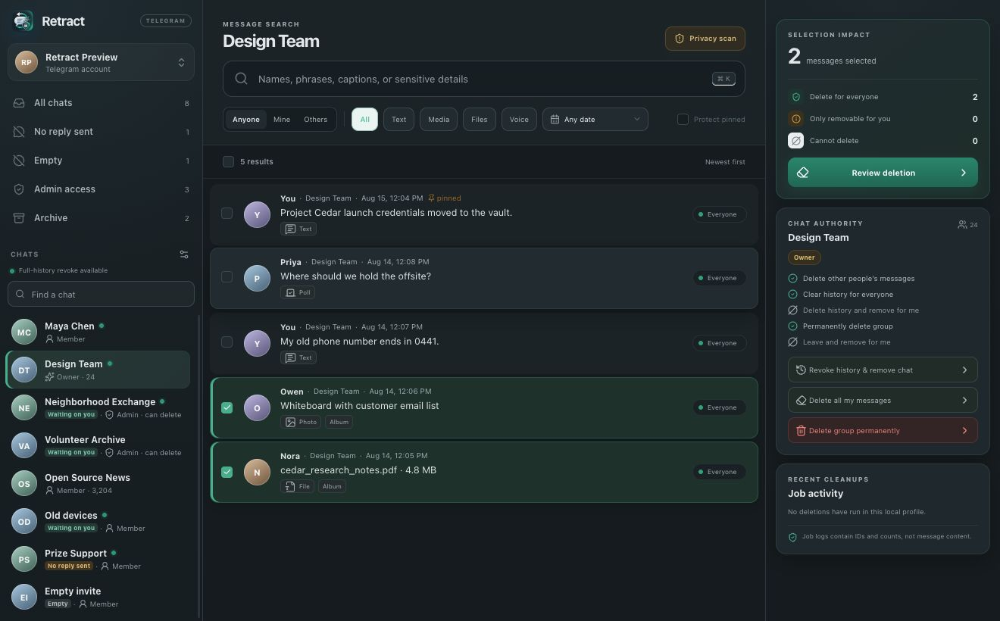

<p align="center">
  
</p>

<h1 align="center">Retract</h1>

<p align="center"><strong>Find sensitive chat history and remove as much of it as each service still permits.</strong></p>

<p align="center">
  <a href="LICENSE"></a>
  <a href="https://github.com/Pryzm-Labs/retract/actions/workflows/secure-build.yml"></a>
  
  
</p>

> [!WARNING]
> Retract is destructive pre-release software. Review every frozen plan and begin with a new disposable conversation. Preview archives are ad-hoc signed but are **not Apple-notarized**. Build from source if you do not want to run an unsigned download.



*Synthetic fixture data shown; no real Telegram account or conversation is pictured.*

Retract is a local-first macOS desktop app for searching and cleaning Telegram and Discord history. Credentials, sessions, imported archives, message search, sensitive-data detection, and deletion execution stay on your Mac. There is no Retract cloud service or telemetry.

## What Retract can do

- Search keywords across accessible normal and secret chats, including text, captions, filenames, and common media metadata.
- Find likely sensitive data such as email addresses, phone numbers, locations, identity-document language, payment details, IP addresses, recovery phrases, and Ethereum, checksum-valid Bitcoin, and context-associated Solana wallet formats.
- Filter chats that are empty or have no message sent by your account, making abandoned and spam-like conversations easier to review.
- Explain whether each selected item can be deleted for everyone, only for you, or not at all.
- Revoke selected messages, your own history, or the broadest history an administrator can remove before leaving a group.
- Clear or remove a conversation from your own chat list even when there is nothing you can revoke for the other participant.
- Permanently delete a group only when Telegram reports that the signed-in owner has that capability, through a separate critical action.
- Resume eligible, previously authorized frozen-ID cleanup batches after a flood wait or restart only under the same verified account/source, without expanding the reviewed target set. Dynamic whole-history, self-only history, sender-wide, and permanent group-deletion operations stop after an ambiguous restart and require a new review.
- Inspect complete cleanup outcomes on demand, including skipped, failed and uncertain results, retry timing, and safe explanations for blocked work.
- Import a Discord Data Package, search only the messages attributed to that archive's owner, and delete selected exact message IDs after verifying the matching Discord account.

Text, photos, videos, documents, voice messages, albums, captions, and other attachments are deleted with their Telegram message when Telegram accepts the request. Discord cleanup targets the exact channel/message IDs in the imported package; it does not crawl Discord or delete other users' messages.

## Important limits

Retract can request only the deletion scope Telegram currently grants your account. It never converts a failed **delete for everyone** operation into **delete only for me**.

Telegram deletion is not global erasure. Forwarded messages, quoted copies, screenshots, downloaded files, exports, notification history, moderation records, backups, and other copies outside Telegram may remain. Sensitive-data detection is heuristic: it can miss data and produce false positives. Retract does not OCR images or inspect document contents.

> [!CAUTION]
> Discord explicitly says that automating a normal user account (a “self-bot”) is forbidden and can result in account termination. Retract's Discord cleanup is an unofficial, unsupported form of normal-user automation. Use it only if you understand and accept that account risk. See [Discord's self-bot policy](https://support.discord.com/hc/en-us/articles/115002192352-Automated-User-Accounts-Self-Bots).

Discord deletion is also not guaranteed global erasure. Access may have changed since the archive was created, attachments can remain cached for a period, and legal, safety, backup, quoted, copied, or downloaded records may remain. A successful run means Discord returned success or that the exact message was already absent; an ambiguous response is never reported as confirmed deletion.

## Install an unsigned preview

The v0.1.x preview supports Apple-silicon Macs running macOS 12 or newer.

1. Download the `.app.zip` and matching `.sha256` from the [Releases page](https://github.com/Pryzm-Labs/retract/releases). Preview builds are published as prereleases.
2. Verify the checksum from the download directory:

   ```sh
   shasum -a 256 -c Retract-v*-macos-arm64.app.zip.sha256
   ```

3. Extract the archive and move **Retract.app** to Applications.
4. Attempt to open Retract. macOS will warn that the app is not notarized.
5. Open **System Settings → Privacy & Security**, find the blocked-app message, choose **Open Anyway**, and confirm only if you trust the downloaded source and checksum.

Do not disable Gatekeeper globally. Each release also publishes a manifest tying the archive to its source tag.

## Build from source

Requirements: Apple-silicon macOS 12+, [Node.js 24.19.0](.nvmrc), Rust 1.97.1, npm, Git, and the Xcode Command Line Tools. The repository includes the pinned TDLib 1.8.64 library; a normal build does not require you to compile TDLib manually.

```sh
git clone https://github.com/Pryzm-Labs/retract.git
cd retract
npm ci --ignore-scripts
npm run tauri dev
```

`npm run tauri dev` verifies the bundled TDLib checksum and architecture before launch. If the artifact is absent or for another architecture, the ensure script can rebuild the exact pinned TDLib revision; only that exceptional path needs CMake, gperf, and OpenSSL 3.

Environment variables in [`.env.example`](.env.example) are optional developer and CI overrides—not end-user setup. Do not use `VITE_*` variables for Telegram secrets and never commit an `.env` file.

## Choose a data source

On first launch, Retract asks you to connect Telegram or import a Discord Data Package. There is no fixture or demo option in the end-user app, and Telegram is not required for Discord cleanup.

### Connect Telegram

1. Sign in to [my.telegram.org](https://my.telegram.org) and open **API development tools**.
2. Create an application if needed, then copy its numeric API ID and 32-character API hash.
3. Enter both values in Retract. Enable Telegram's test server only when using disposable test-DC accounts.
4. Save settings and complete QR, phone/code, and two-step verification as requested by Telegram.

The API hash, TDLib database key, and encrypted job-store key live in one versioned macOS Keychain vault. Session databases use TDLib encryption in the operating system's app-data directory. The version-3 job store is authenticated to its provider/profile; plans and jobs additionally bind the verified account and source. Telegram message bodies and private filenames are not indexed automatically or stored in Retract's job state. Exact confirmation titles remain encrypted plan data.

### Import and clean Discord history

First request a package in Discord under **User Settings → Data & Privacy → Request your data**. Discord says package generation can take up to 30 days; its [Data Package guide](https://support.discord.com/hc/en-us/articles/360004957991-Your-Discord-Data-Package) explains the contents and current request flow.

1. In Retract, choose **Import Discord package** and select the ZIP. Do not extract it first.
2. Wait for the local import counter to reach **Archive ready**, then choose the imported account.
3. Search and privacy-scan the archive before connecting to Discord. Importing alone never contacts Discord or deletes anything.
4. Open Discord connection settings. Read and acknowledge the unsupported-account-automation warning.
5. Choose any detected Chrome, Edge, Brave, Arc, Vivaldi, Opera, Chromium, or Firefox installation. Retract opens a new isolated temporary browser profile and observes only a plausible `Authorization` header on an HTTPS `discord.com/api` request. It never reads your normal browser profile.
6. If your browser is unsupported—or automatic capture does not work—use **Enter token manually**, which is always available. Follow the in-app browser-neutral Developer Tools instructions and paste only the `Authorization` header value, never a password, cookie, or bot token.
7. Retract verifies `/users/@me` and refuses to continue unless the account ID exactly matches the selected archive owner.
8. Leave **Remember in macOS Keychain** off for a memory-only session. If enabled, use **Forget** in Discord connection settings to remove the saved token and clear the in-memory session.
9. Select exact archive messages, review the frozen plan and pacing warning, type `DELETE DISCORD MESSAGES`, and complete the macOS device-owner prompt.

Discord may rate-limit a large cleanup, so completion can take a long time. Retract serializes each channel, caps cross-channel work, follows bounded rate-limit delays, and never treats an uncertain request as deleted. The archive remains local evidence after remote deletion; removing the original ZIP or Retract's imported copy is a separate decision.

First archive use obtains an independent key and upgrades the shared vault while retaining Telegram secret values. **Quit all older Retract copies before first archive use**; older running binaries cannot honor the credential lease, and vault-format downgrades are unsupported. Imported-copy removal cannot erase exports, remote data, backups or filesystem snapshots. See [archive storage details](docs/ARCHIVE_STORAGE.md).

When upgrading older job state, Retract retains its exact ciphertext as `jobs.pre-provider.enc` and replaces the active `jobs.enc` with version 3. Older versions cannot read the active v3 file. The backup is never automatically restored or removed; unfinished legacy jobs require a new review. Work belonging to a different account stays blocked, never retargeted. This job migration preserves credential values and TDLib session/profile paths; the separate archive-key upgrade is described above. See the [migration contract](docs/TELEGRAM_CHARACTERIZATION.md#current-encrypted-store-and-migration-contract).

Connection failures show a safe diagnostic with verification retry and connection settings. If a profile is in use, close the other Retract process before retrying. Invalid state remains blocked: preserve the profile and backup rather than deleting or restoring files. A failed settings replacement can be corrected in the app; recovery rediscovers the current connection without automatically repeating a save or cleanup.

## Make the first deletion safely

Do not begin with an old or valuable chat. Follow the complete [local live-test guide](docs/LOCAL_LIVE_TEST.md); the short version is:

1. Prefer Telegram's test DC. Otherwise create a new private group with one informed participant.
2. Send a unique harmless text message, a disposable image, and a disposable file from your own account.
3. Search the unique token in Retract and filter to **Mine**.
4. Select only those fixtures and confirm the impact panel says **Delete for everyone** for every item.
5. Review the immutable plan, run it, and have the other participant verify that each Telegram message disappeared.

Stop if the displayed reach is not what you expect. Test chat-wide, leave, administrator, and group-destruction actions only after selected-message deletion succeeds. The full release gate is in [docs/TEST_PLAN.md](docs/TEST_PLAN.md).

For Discord, use a disposable account or harmless message set and accept the account-enforcement risk before testing. Request a fresh archive containing a unique message, import it, verify the connected Discord ID matches, select only that message, and have another participant confirm it is gone. Do not test against an account or history you cannot afford to lose.

## Verify in Docker

The preferred project check runs pinned Node and Rust toolchains as a non-root BuildKit user. Project-controlled build and test commands run without network access, and the target uses a cache-only exporter so it does not leave a multi-gigabyte runnable image.

```sh
npm run container:check
```

Docker reduces host toolchain exposure but is not a complete supply-chain sandbox: the Docker daemon, base images, online dependency acquisition, and produced artifacts remain trusted. Review lockfile and base-image digest changes like source changes.

Useful disk commands:

```sh
docker system df
npm run container:cache:status
npm run container:cache:prune
```

The prune command is interactive and scoped to Retract's named BuildKit caches. Retract never prunes unrelated Docker data automatically. Native macOS packaging still runs on macOS because Xcode and Apple frameworks cannot run in a Linux container.

## Security and architecture

- React and TypeScript render the three-pane UI; the webview cannot authorize a destructive operation.
- Rust freezes plans, binds provider/account/source, rechecks live authority where supported, owns confirmations, batches, encrypted state, retries, and cancellation.
- Every destructive action requires a fresh, single-use Touch ID or Mac login-password grant whose native prompt identifies the backend-frozen chat, sender, message count, and plan token as applicable.
- TDLib is pinned by source commit and SHA-256, bundled as a native app resource, and checked before use.
- The webview uses a strict content security policy and a minimal Tauri capability allowlist.
- Production bundles resolve only the desktop IPC adapter. Synthetic fixture data is compiled only for tests and the dedicated screenshot build.

Read [docs/THREAT_MODEL.md](docs/THREAT_MODEL.md) for trust boundaries and residual risks. Report vulnerabilities privately according to [SECURITY.md](SECURITY.md). Never attach Telegram or Discord credentials, tokens, sessions, exports, databases, or private screenshots to a public issue.

## Contributing

See [CONTRIBUTING.md](CONTRIBUTING.md) and the [Code of Conduct](CODE_OF_CONDUCT.md). Contributions must use synthetic data and preserve the invariant that everyone-scoped deletion never silently becomes self-only deletion.

Retract is licensed under the [MIT License](LICENSE). Bundled dependency notices are in [THIRD_PARTY_NOTICES.md](THIRD_PARTY_NOTICES.md). Release history is in [CHANGELOG.md](CHANGELOG.md), and the original product rationale remains in [PLAN.md](PLAN.md).
